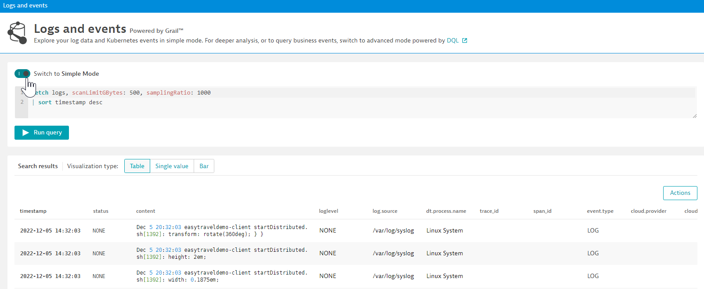

## Explore the Basics of DQL

### Step 1

In order to access logs on GRAIL, from the main menu in your environmnet, expand 'Observe & Explore' and select 'Logs'.



Once in the advanced mode you'll find the default query producing the content in the table. All DQL queries will begin with a `fetch` for the type of data to query. There will be many fetch options available. To see all available records stored in grail try executing the following:

```
fetch recordTypes
```

For the purposes of these hands-on labs we will always begin with `fetch logs`.

The default query also shows available limits against the data - `scanLimitGBytes` and `samplingRatio` each of these options can be used independently or together. While developing your query it is best practice to use them until the final result requires precise results.

Since commands are chained together with a `|` (pipe); the results are also sorted by the timestamp field in DESC order.

### Step 2 - Timeframe and basic filters

Timeframe can optionally be directly included in the query. If it is excluded, the global timeframe selector will be inherited by the log viewer.

To override the global timeframe selector try the following query using `from:`

```
fetch logs, scanLimitGBytes: 500, samplingRatio: 1000, from: now() -2h
| sort timestamp desc
```

Now, let's try finding all log records where the 'status' = error:

```
fetch logs, scanLimitGBytes: 500, samplingRatio: 1000, from: now() -2h
| filter status == "ERROR"
| sort timestamp desc
```

**Note: field values are case-sensitve**

Combine filters with AND/OR logic:

Show all logs related to any .NET technology that have log level = error:

```
fetch logs, scanLimitGBytes: 500, samplingRatio: 1000, from: now() -2h
| filter loglevel == "ERROR" and matchesPhrase(process.technology, ".NET")
| sort timestamp desc
```

### Step 3 - Clean up results with field selectors

`fields:` command allows you to select which fields to display results for.

Starting with the DQL Query:

```
fetch logs, scanLimitGBytes: 500, samplingRatio: 1000, from: now() -2h
| filter loglevel == "ERROR" and matchesPhrase(process.technology, ".NET")
| sort timestamp desc
```

Add the `fields:` command to the query and only select the following fields:

- timestamp
- content
- dt.entity.host
- process.technology

The resulting query should look like:

```
fetch logs
| filter loglevel == "ERROR" and matchesPhrase(process.technology, ".NET")
| fields timestamp, content, dt.entity.host, process.technology 
| sort timestamp desc
```

### Step 4 - contains() vs matchesPhrase()

To find log records that match a portion of a specific field we can use the `contains()` or `matchesPhrase()` function. For performance and efficiency it is a best practice to use matchesPhrase() vs contains().

```
fetch logs
| filter matchesPhrase(content, "Connection started")
```

Matching can be used on any field of a record. The `matchesPhrase()` function must match as a complete string example:

`matchesPhrase()`

```
fetch logs
| filter matchesPhrase(dt.process.name, "MsgBrokerService.exe")
```

The above query should not return any results.

However, using `contains()`

```
fetch logs
| filter contains(dt.process.name, "MsgBrokerService.exe")
```

will return results.

### This completes the DQL basics Lab!
