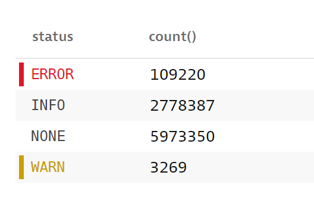
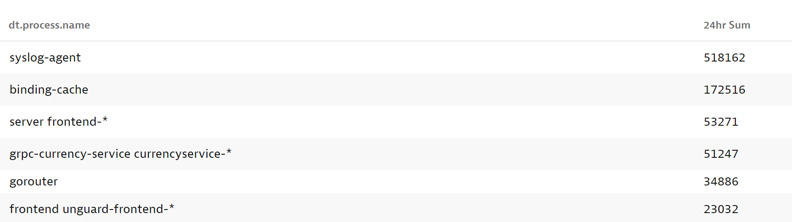

## Observe aggregates over time and summarize in DQL

This lab is designed to explore common use-cases for aggregating data and viewing trends. After building each query pin the results to a dashboard which you can later export for review of the queries built in each lab.

## Introducing the Summarize command

One of the most common scenarios is to find out the amount of times a specific error has happened. We have seen how we can implement some filters in order to get a more meaningful dataset, now it is time to combine that with other functions in order to start summarizing the results in more meaningful ways. Assuming we want to check the amount of error level logs due to "Time out"

### Step 1 - Filter log records

Starting with the below DQL query, create appropriate filters to find the relevant log entries for the requirements above.

```
fetch logs, scanLimitGBytes:500, samplingRatio:1000
| fields timestamp, content, log.source, dt.process.name
| sort timestamp desc
```

<h2><details>
    <summary>Click to Expand Solution</summary>

```
fetch logs, scanLimitGBytes:500, samplingRatio:1000
| fields timestamp, content, log.source, dt.process.name
| filter matchesPhrase(content, "Time out")
| sort timestamp desc
```

</details></h2>

### Step 2 - Get the total count

Now that we have the records matching the requirements it's time to aggregate them together for a total count in the time period. Since each record represents an error level log due to a timeout, the goal is to sum the count of all records.

To aggregate any results, we'll use the "summarize" command in DQL.

### Helpful Link: [Summarize Command documentation](https://www.dynatrace.com/support/help/how-to-use-dynatrace/dynatrace-query-language/commands#summarize)

Modify the current query to show the total count of timeouts and include a custom column name for the count. Now that we want exact results, we'll remove the scanLimitGB & samplingRatio from the query.

<h2><details>
    <summary>Click to Expand Solution</summary>

```
fetch logs
| fields timestamp, content, log.source, dt.process.name
| filter matchesPhrase(content, "Time out")
| summarize Timeouts = count()
```

</details></h2>

### Step 3 - Show 1 hour trend of total timeouts

We've built a DQL query that will show the total timeouts for any time period requested. We can also show the same results as a trend over some aggergation of time using the `by:` command within the summarize pipe.

Modify the query to show the total number of errors for each 1 hour aggregation for today's timeframe.

Reference the summary command documentation above for usage of the `bin` function within the `by:` command.

<h2><details>
    <summary>Click to Expand Solution</summary>

```
fetch logs
| fields timestamp, content, log.source, dt.process.name
| filter matchesPhrase(content, "Time out")
| summarize Timeouts = count(), by: {bin(timestamp, 1h)}
```

</details></h2>


## Bonus Exercises

1. Build a DQL query that produces a count of all records grouped by status and ensures the status field is not null.

_Note that values in the image below are expected to differ from your results_



2. Build a DQL query that finds the top process name with the most error records in the last 24 hours (using dql to specify the timeframe). Sort the table by descending order. Hint - your filter should be ERROR (case sensitive).

_Note that values and process names in the image below are expected to differ from your results._


