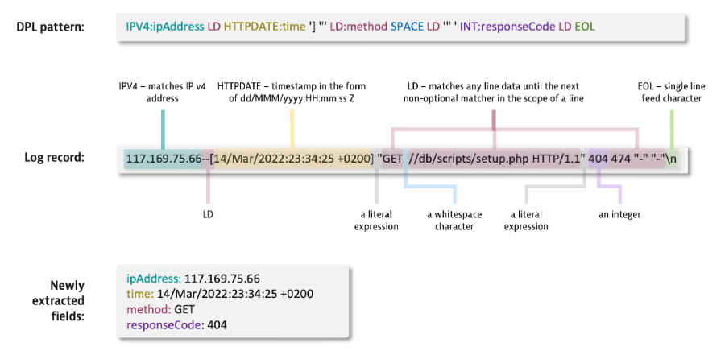
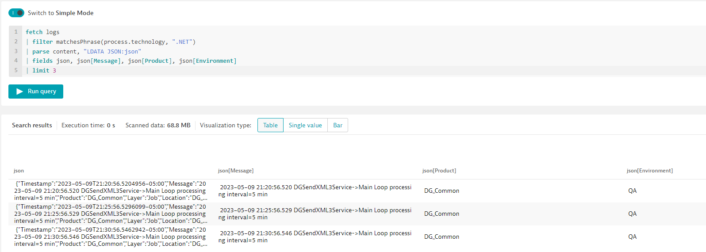
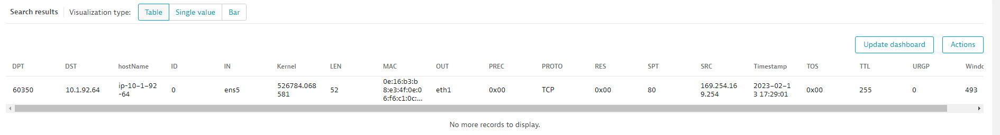

## Using built-in functions of DQL

This lab is designed to review a few hands-on examples of the most common built-in functions of DQL. After building some of these queries we will pin them to a dashboard for future reference.

For a full list of all the available functions check out our [help documents](https://www.dynatrace.com/support/help/how-to-use-dynatrace/log-and-event-processing/log-and-event-processing-functions)

## Conversion Functions

Conversion functions are used to convert one data type to another type (ex. Integer to String)

### **Example 1 - Arrays**

In this example we'll convert a list of numbers and a list of strings into an array.

First let's create some data:

```
fetch logs
| fields var_value = 235711131719, num_array = array(2, 3, 5, 7, 11, 13, 17, 19, 23, 29, 2, 3, 5, 7, 11)
```

Now lets turn each into an array, but using the `toArray` function

```
fetch logs //, scanLimitGBytes: 500, samplingRatio: 1000
| fields var_value = 235711131719, num_array = array(2, 3, 5, 7, 11, 13, 17, 19, 23, 29, 2, 3, 5, 7, 11)
| fields toArray(num_array), toArray(var_value)
```

And for tidiness, let's limit the results to 1 record

```
fetch logs //, scanLimitGBytes: 500, samplingRatio: 1000
| fields var_value = 235711131719, num_array = array(2, 3, 5, 7, 11, 13, 17, 19, 23, 29, 2, 3, 5, 7, 11)
| fields toArray(num_array), toArray(var_value)
| limit 1
```

## DQL Parsing

Dynatrace Pattern Language (DPL) is a pattern language that allows you to describe patterns using matchers, where a matcher is a mini-pattern that matches a certain type of data. For example, IPADDR matches IPv4 or IPv6 addresses. There are matchers available to handle all kinds of data types.

### Matching vs Parsing
A matcher will extract data only when it has been assigned an export name - this is an arbitrary name of your choice, which becomes the name of the field you use in query statements. In this example, the pattern has 11 matchers in total, 4 of which are extracting data. The matchers extracting data are defined by a colon (:) followed by the exporter name.



### JSON Parsing

As it is most likely that you have worked with JSON before, that is the first exercise that we will go through. Our hipstershop application is logging very useful data in JSON format. 

### Step 1 - Understanding the data

The following query gives us an idea of the useful parameters that we can use, like the response size in KB, response status code and response time of each one of the received requests:

```
fetch logs
| filter matchesPhrase(process.technology, ".NET")
| fields content
| limit 2
```
This will give you sample information of log entries with the information that we are looking for:

### Step 2 - Parsing the JSON response

Now that we have example log entry with some interesting data parameters, let's use the parse command to extract the data values for Message, Product, and Envrionment parameters. Since most of the contents of these kind of log entries are already in JSON format, DQL offers a convenient way to parse it. In this case we will use the __json__ variable to store the parsed result. Doing this will enumerate all elements, transform them into Log processing data type from their defined type in JSON and returns a variant_object with parsed elements. 
Now that we have the JSON object parsed, we can access individual parameters and list those as fields

```
fetch logs
| filter matchesPhrase(process.technology, ".NET")
| parse content, "LDATA JSON:json"
| fields json, json[Message], json[Product], json[Environment]
| limit 2
```




### Step 3 - Accessing JSON parameters from the parsed result

Now that we can refer the JSON result using the __json__ identifier, we can use the normal JSON key:value convention to access parameters from the result. Also take a look at the conditional in the fourth row, we are going to work only with entries that had a JSON response making sure the JSON payload contains a __Environment__ parameter, optimizing our query.

```
fetch logs
| filter matchesPhrase(process.technology, ".NET") and matchesPhrase(content, "Message")
| parse content, "LDATA JSON:json"
| filter isNotNull(json[Environment])
| fields json, Message = json[Message], Product = json[Product], Environment = json[Environment]
| limit 3
```

### Step 4 - Summarizing records based on Product and Environment

With the new fields that we extracted from parsing the JSON response, now we can start implementing some functions and logic to summarize which are the combinations of Products and Environments with the most records.

```
fetch logs
| filter matchesPhrase(process.technology, ".NET") and matchesPhrase(content, "Message")
| parse content, "LD '|' SPACE LD:severity SPACE '|' SPACE JSON:json"
| filter isNotNull(json[Environment])
| fields Product = json[Product], Environment = json[Environment]
| summarize count(), by:{Product, Environment}
| sort `count()` desc
```


Start from here


## Additional exercises - Parsing only

As we saw before, we can use Dynatrace's parsing capabilities to access JSON content to be able to retrieve values in a dynamic way.
On top of that, we can use the same capabilities to be able to parse values out of text responses. Parsing puts the resulting values into one or more fields as specified in the pattern. This is especially useful when defining log processing rules, which eventually can be used to define custom log attributes that can be leveraged as dimensions in custom metrics.

### Sample data for parsing

Using the following query will provide you with a sample string that can be parsed into multiple different fields using different types of matchers, like LD (Line data matcher), IPADDR (for matching IPv4 and IPV6 addresses), INT (integral numbers) and TIMESTAMP.

```
fetch logs
| limit 1
| fields contentToParse = "Feb 13 2023 17:29:01 ip-10-1-92-64 kernel: [526784.068581] [UFW AUDIT] IN=ens5 OUT=eth1 MAC=0e:16:b3:b8:e3:4f:0e:06:f6:c1:0c:7c:08:00 SRC=169.254.169.254 DST=10.1.92.64 LEN=52 TOS=0x00 PREC=0x00 TTL=255 ID=0 PROTO=TCP SPT=80 DPT=60350 WINDOW=493 RES=0x00 ACK URGP=0 "
```

### Exercise 1 - Extracting the timestamp

In the provided example, the timestamp is the first parameter, so it is a good exercise on how to transform the string to parse into a DPL expression in order to be able to extract only specific parameters. 
Using the [Grammar](https://www.dynatrace.com/support/help/how-to-use-dynatrace/dynatrace-pattern-language/log-processing-grammar) and [Time and Date](https://www.dynatrace.com/support/help/how-to-use-dynatrace/dynatrace-pattern-language/log-processing-time-date#conversion-patterns) documentation, we can use the TIMESTAMP expression with the right parameters for referencing the date and time, and once referenced we can extract the value using a variable. It is important to note that DPL needs to match the whole content to be parsed, so we need to add the LD expression after our timestamp to tell DQP to read the rest of the line data.

```
fetch logs
| limit 1
| fields contentToParse = "Feb 13 2023 17:29:01 ip-10-1-92-64 kernel: [526784.068581] [UFW AUDIT] IN=ens5 OUT=eth1 MAC=0e:16:b3:b8:e3:4f:0e:06:f6:c1:0c:7c:08:00 SRC=169.254.169.254 DST=10.1.92.64 LEN=52 TOS=0x00 PREC=0x00 TTL=255 ID=0 PROTO=TCP SPT=80 DPT=60350 WINDOW=493 RES=0x00 ACK URGP=0 "
| parse contentToParse, "TIMESTAMP('MMM d y HH:mm:ss'):Timestamp LD"
```

### Exercise 2 - Extracting parameters in the middle

We can use DPL to target multiple parameters using a single parse command and a single expression. In this case, we can target other useful information presented in the example string. We can target the Kernel information, found within square brackets after the "kernel:" sub-string, and the source IP, found after the "SRC=" sub-string.

```
fetch logs
| limit 1
| fields contentToParse = "Feb 13 2023 17:29:01 ip-10-1-92-64 kernel: [526784.068581] [UFW AUDIT] IN=ens5 OUT=eth1 MAC=0e:16:b3:b8:e3:4f:0e:06:f6:c1:0c:7c:08:00 SRC=169.254.169.254 DST=10.1.92.64 LEN=52 TOS=0x00 PREC=0x00 TTL=255 ID=0 PROTO=TCP SPT=80 DPT=60350 WINDOW=493 RES=0x00 ACK URGP=0 "
| parse contentToParse, "LD 'kernel:' SPACE? '[' LD:kernel ']' LD 'SRC=' IPADDR:src LD"
```

### Optional excercise - Fully parametize the complete string

As we have seen, we can target one or more parameters within an object for dynamically extracting data. We can break down the whole string into individual parameters.
This is a query that you can use to completely breakdown the provided sample string. This same logic can be implemented to results provided by fetching logs.

```
fetch logs
| limit 1
| fields contentToParse = "Feb 13 2023 17:29:01 ip-10-1-92-64 kernel: [526784.068581] [UFW AUDIT] IN=ens5 OUT=eth1 MAC=0e:16:b3:b8:e3:4f:0e:06:f6:c1:0c:7c:08:00 SRC=169.254.169.254 DST=10.1.92.64 LEN=52 TOS=0x00 PREC=0x00 TTL=255 ID=0 PROTO=TCP SPT=80 DPT=60350 WINDOW=493 RES=0x00 ACK URGP=0 "
| parse contentToParse, "TIMESTAMP('MMM d y HH:mm:ss'):Timestamp SPACE LD:hostName SPACE LD '['LD:Kernel']' LD 'IN='LD:IN SPACE 'OUT='LD:OUT SPACE 'MAC='LD:MAC SPACE 'SRC='IPADDR:SRC SPACE 'DST='IPADDR:DST SPACE 'LEN='INT:LEN SPACE 'TOS='LD:TOS SPACE 'PREC='LD:PREC SPACE 'TTL='INT:TTL SPACE 'ID='INT:ID SPACE 'PROTO='LD:PROTO SPACE 'SPT='INT:SPT SPACE 'DPT='INT:DPT SPACE 'WINDOW='INT:Window SPACE 'RES='LD:RES SPACE LD 'URGP='INT:URGP"
| fieldsRemove contentToParse
```

The goal is to breakdown the provided entry into individual fields, the result should look something like this:




**Useful links**

[Log processing grammar](https://www.dynatrace.com/support/help/how-to-use-dynatrace/dynatrace-pattern-language/log-processing-grammar "Grammar")

[Log processing modifiers](https://www.dynatrace.com/support/help/how-to-use-dynatrace/dynatrace-pattern-language/log-processing-modifiers "Modifiers")

[Log processing JSON objects](https://www.dynatrace.com/support/help/how-to-use-dynatrace/dynatrace-pattern-language/log-processing-json-object "JSON Object")


